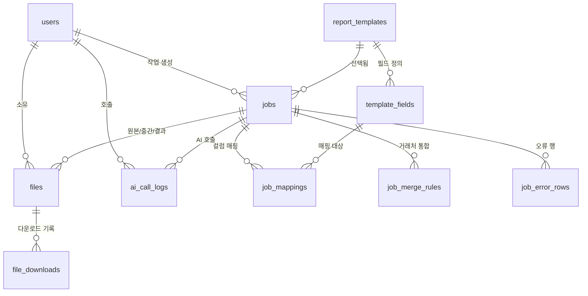

# 001. AI Excel 보고서 자동생성기

# DB 설계서

> 기준 문서: `requirements.md`, `features.md`, `screens.md`
> DBMS: **PostgreSQL** (JSONB, UUID 사용). 다른 DBMS를 쓰면 타입만 바꿔 적용한다. (가정)
> `(가정)` 표시는 확인 전 임시 결정이다.

---

## 1. 설계 원칙

1. **DB에는 메타 정보만 저장하고, 업로드된 데이터의 행(row)은 저장하지 않는다.**
   원본, 정규화 결과, 보고서는 파일 저장소에 두고 DB는 경로와 요약만 가진다. 고객 데이터가 DB에 쌓이지 않아 보안과 삭제 관리(30일 보관)가 단순해진다.
2. **작업(job) 하나가 모든 것의 중심이다.** 마법사 1회 실행 = job 1건. 매핑, 오류 행, 파일, 통합 규칙이 job에 매달린다.
3. **외부에 노출되는 ID는 UUID**로 한다. (`users`, `jobs`, `files`) URL을 추측해 다른 사람의 파일에 접근하는 것을 막는다.
4. **모든 조회는 `user_id`로 제한한다.** (BR-08) 다른 사용자의 job, file은 조회되지 않아야 한다.
5. **AI 추천과 사용자 확정을 둘 다 남긴다.** 나중에 "AI가 몇 % 맞혔는가"를 측정하는 근거가 된다. (`idea.md`의 성공 기준)
6. 템플릿 정의는 MVP에서 **개발자가 DB에 직접 등록**한다. 집계 규칙과 셀 위치는 변경이 잦고 구조가 복잡해서 JSONB로 둔다.

---

## 2. ERD



---

## 3. 테이블 목록

| 테이블 | 용도 | 관련 기능 / 화면 |
|---|---|---|
| `users` | 사용자 계정 | F-012 / S-01 |
| `report_templates` | 보고서 템플릿 정의 (양식 파일, 집계 규칙, 셀 위치) | F-002 / S-03 |
| `template_fields` | 템플릿이 요구하는 필드 (필수 여부, 타입) | F-002, F-004 / S-03, S-05 |
| `jobs` | 작업 1건 (마법사 1회 실행), 진행 상태, 결과 요약 | 전체 / S-02 ~ S-09 |
| `files` | 원본, 정규화 중간 파일, 결과 보고서의 저장 정보 | F-001, F-008, F-010 |
| `job_mappings` | 보고서 필드와 원본 컬럼의 매핑 (AI 추천 + 사용자 확정) | F-004, F-005 / S-05, S-09 |
| `job_merge_rules` | 거래처명 통합 제안과 적용 여부 | F-006 / S-06 |
| `job_error_rows` | 정규화 실패 행 목록 | F-006 / S-06, S-09 |
| `ai_call_logs` | AI 호출 기록 (비용, 실패, 대체 여부) | F-004 |
| `file_downloads` | 결과 파일 다운로드 기록 | F-010 / S-08 |

---

## 4. 상태값 정의

### jobs.status

| 값 | 의미 | 이력 목록 표시 |
|---|---|---|
| `draft` | 마법사 진행 중 (1~5단계) | 표시 안 함 |
| `generating` | 집계 및 보고서 생성 중 | 표시 안 함 |
| `succeeded` | 보고서 생성 성공 | 성공 |
| `failed` | 생성 실패 (사유 기록) | 실패 |

### jobs.current_step

마법사 단계 번호 1~6. (1 업로드, 2 템플릿, 3 데이터 확인, 4 매핑, 5 정규화, 6 결과)

### job_mappings.confidence

`high`(높음) / `medium`(중간) / `low`(낮음) / `none`(미매핑)

### job_mappings.origin

| 값 | 의미 |
|---|---|
| `ai` | AI가 추천한 값을 사용자가 그대로 확정 |
| `rule` | AI 호출 실패로 규칙 기반 추천을 사용 |
| `history` | 이전 작업의 매핑을 불러와 사용 |
| `user` | 사용자가 직접 변경 |

### files.kind

`source`(원본) / `normalized`(정규화 중간 파일) / `result`(결과 보고서)

### job_error_rows.reason_code

| 값 | 의미 |
|---|---|
| `INVALID_DATE` | 날짜로 해석 불가 |
| `INVALID_NUMBER` | 숫자로 변환 불가 |
| `EMPTY_REQUIRED` | 필수 값이 비어 있음 |

---

## 5. 테이블 정의 (DDL)

```sql
-- =========================================================
-- 사용자
-- =========================================================
CREATE TABLE users (
    id             UUID         PRIMARY KEY DEFAULT gen_random_uuid(),
    email          VARCHAR(255) NOT NULL,
    password_hash  VARCHAR(255) NOT NULL,              -- bcrypt/argon2 해시, 평문 저장 금지
    created_at     TIMESTAMPTZ  NOT NULL DEFAULT now(),
    last_login_at  TIMESTAMPTZ
);
CREATE UNIQUE INDEX uq_users_email ON users (lower(email));   -- 대소문자 구분 없이 중복 방지


-- =========================================================
-- 보고서 템플릿 (개발자가 사전 등록)
-- =========================================================
CREATE TABLE report_templates (
    id                 BIGINT       GENERATED ALWAYS AS IDENTITY PRIMARY KEY,
    name               VARCHAR(100) NOT NULL,
    description        TEXT,
    template_file_path VARCHAR(500) NOT NULL,          -- 템플릿 .xlsx 저장 경로
    version            INT          NOT NULL DEFAULT 1,
    aggregation_rules  JSONB        NOT NULL,          -- 집계 규칙 (예시는 6장)
    cell_map           JSONB        NOT NULL,          -- 결과가 들어갈 시트/셀 위치 (예시는 6장)
    is_active          BOOLEAN      NOT NULL DEFAULT true,
    created_at         TIMESTAMPTZ  NOT NULL DEFAULT now(),
    updated_at         TIMESTAMPTZ  NOT NULL DEFAULT now()
);

CREATE TABLE template_fields (
    id           BIGINT       GENERATED ALWAYS AS IDENTITY PRIMARY KEY,
    template_id  BIGINT       NOT NULL REFERENCES report_templates(id) ON DELETE CASCADE,
    field_key    VARCHAR(50)  NOT NULL,                -- 코드에서 쓰는 키 (예: customer, sale_date, amount)
    field_name   VARCHAR(100) NOT NULL,                -- 화면 표시명 (예: 고객사)
    data_type    VARCHAR(10)  NOT NULL CHECK (data_type IN ('text', 'number', 'date')),
    is_required  BOOLEAN      NOT NULL DEFAULT false,
    sort_order   INT          NOT NULL DEFAULT 0,
    ai_hint      TEXT,                                 -- AI 매핑 정확도를 높이는 설명 (예: "거래 상대 회사명")
    UNIQUE (template_id, field_key)
);


-- =========================================================
-- 작업 (마법사 1회 실행)
-- =========================================================
CREATE TABLE jobs (
    id                  UUID         PRIMARY KEY DEFAULT gen_random_uuid(),
    user_id             UUID         NOT NULL REFERENCES users(id) ON DELETE CASCADE,
    template_id         BIGINT       REFERENCES report_templates(id),   -- 2단계 선택 전에는 NULL
    template_version    INT,                                            -- 작업 당시의 템플릿 버전 기록
    status              VARCHAR(12)  NOT NULL DEFAULT 'draft'
                        CHECK (status IN ('draft', 'generating', 'succeeded', 'failed')),
    current_step        SMALLINT     NOT NULL DEFAULT 1 CHECK (current_step BETWEEN 1 AND 6),

    original_file_name  VARCHAR(255),                                   -- 이력 목록 표시용 (파일 삭제 후에도 유지)
    sheet_name          VARCHAR(100),
    header_row          INT          NOT NULL DEFAULT 1,
    total_rows          INT,                                            -- 원본 데이터 행 수
    processed_rows      INT,                                            -- 보고서에 반영된 행 수
    excluded_rows       INT,                                            -- 오류로 제외된 행 수

    column_profile      JSONB,                                          -- S-04 컬럼 분석 결과 (6장 예시)
    summary             JSONB,                                          -- 집계 요약: 합계, 그룹별 건수 등
    error_code          VARCHAR(50),                                    -- 실패 시 코드
    error_message       TEXT,                                           -- 실패 시 사용자 표시용 사유

    created_at          TIMESTAMPTZ  NOT NULL DEFAULT now(),
    updated_at          TIMESTAMPTZ  NOT NULL DEFAULT now(),
    completed_at        TIMESTAMPTZ
);
CREATE INDEX idx_jobs_user_created ON jobs (user_id, created_at DESC);   -- S-08 이력 목록
CREATE INDEX idx_jobs_draft_cleanup ON jobs (updated_at) WHERE status = 'draft';  -- 미완료 작업 정리


-- =========================================================
-- 파일 (원본 / 정규화 중간 파일 / 결과 보고서)
-- =========================================================
CREATE TABLE files (
    id            UUID         PRIMARY KEY DEFAULT gen_random_uuid(),
    user_id       UUID         NOT NULL REFERENCES users(id) ON DELETE CASCADE,
    job_id        UUID         NOT NULL REFERENCES jobs(id) ON DELETE CASCADE,
    kind          VARCHAR(12)  NOT NULL CHECK (kind IN ('source', 'normalized', 'result')),
    file_name     VARCHAR(255) NOT NULL,                -- 사용자에게 보이는 이름
    storage_path  VARCHAR(500) NOT NULL,                -- 저장소 경로 (사용자 ID로 격리: {user_id}/{job_id}/...)
    size_bytes    BIGINT       NOT NULL,
    created_at    TIMESTAMPTZ  NOT NULL DEFAULT now(),
    expires_at    TIMESTAMPTZ  NOT NULL,                -- 보관 만료 시각 (생성 + 30일, 가정)
    deleted_at    TIMESTAMPTZ                           -- 실제 파일 삭제 시각 (NULL이면 존재)
);
CREATE INDEX idx_files_job ON files (job_id);
CREATE INDEX idx_files_expiry ON files (expires_at) WHERE deleted_at IS NULL;   -- 만료 정리 배치


-- =========================================================
-- 컬럼 매핑 (보고서 필드 ↔ 원본 컬럼)
-- =========================================================
CREATE TABLE job_mappings (
    id                   BIGINT       GENERATED ALWAYS AS IDENTITY PRIMARY KEY,
    job_id               UUID         NOT NULL REFERENCES jobs(id) ON DELETE CASCADE,
    field_id             BIGINT       NOT NULL REFERENCES template_fields(id),
    source_column_name   VARCHAR(255),                  -- 확정된 원본 컬럼명 (NULL = 선택 안 함)
    source_column_index  INT,                           -- 원본에서의 컬럼 위치 (0부터)
    ai_suggested_column  VARCHAR(255),                  -- AI가 처음 추천한 컬럼 (정확도 측정용)
    confidence           VARCHAR(6)   NOT NULL DEFAULT 'none'
                         CHECK (confidence IN ('high', 'medium', 'low', 'none')),
    reason               TEXT,                          -- AI 판단 근거 한 줄
    origin               VARCHAR(7)   NOT NULL DEFAULT 'ai'
                         CHECK (origin IN ('ai', 'rule', 'history', 'user')),
    is_confirmed         BOOLEAN      NOT NULL DEFAULT false,
    UNIQUE (job_id, field_id)
);
-- 같은 원본 컬럼을 한 작업 안에서 두 필드에 중복 매핑하는 것을 DB 차원에서 방지
CREATE UNIQUE INDEX uq_job_mappings_source
    ON job_mappings (job_id, source_column_index)
    WHERE source_column_index IS NOT NULL;


-- =========================================================
-- 거래처명 통합 제안
-- =========================================================
CREATE TABLE job_merge_rules (
    id              BIGINT       GENERATED ALWAYS AS IDENTITY PRIMARY KEY,
    job_id          UUID         NOT NULL REFERENCES jobs(id) ON DELETE CASCADE,
    canonical_name  VARCHAR(255) NOT NULL,              -- 통합 후 기준 이름 (예: 대한상사)
    variants        JSONB        NOT NULL,              -- 통합 대상 이름과 건수 (예: [{"name":"(주)대한상사","rows":3}, ...])
    is_applied      BOOLEAN      NOT NULL DEFAULT false -- 기본값 false: 사용자가 체크해야 적용 (BR-06)
);
CREATE INDEX idx_merge_rules_job ON job_merge_rules (job_id);


-- =========================================================
-- 정규화 오류 행
-- =========================================================
CREATE TABLE job_error_rows (
    id             BIGINT       GENERATED ALWAYS AS IDENTITY PRIMARY KEY,
    job_id         UUID         NOT NULL REFERENCES jobs(id) ON DELETE CASCADE,
    row_number     INT          NOT NULL,               -- 원본 파일에서의 행 번호 (사용자가 찾을 수 있게)
    column_name    VARCHAR(255) NOT NULL,
    raw_value      VARCHAR(500),                        -- 원본 값 (500자 초과 시 잘라서 저장)
    reason_code    VARCHAR(30)  NOT NULL,
    reason_message VARCHAR(255) NOT NULL
);
CREATE INDEX idx_error_rows_job ON job_error_rows (job_id, row_number);


-- =========================================================
-- AI 호출 기록 (비용 관리, 실패 추적, 전송 범위 검증)
-- =========================================================
CREATE TABLE ai_call_logs (
    id                  BIGINT       GENERATED ALWAYS AS IDENTITY PRIMARY KEY,
    job_id              UUID         REFERENCES jobs(id) ON DELETE SET NULL,   -- 이력을 지워도 비용 기록은 유지
    user_id             UUID         NOT NULL REFERENCES users(id) ON DELETE CASCADE,
    purpose             VARCHAR(30)  NOT NULL DEFAULT 'column_mapping',
    model               VARCHAR(50),
    status              VARCHAR(20)  NOT NULL
                        CHECK (status IN ('success', 'failed', 'timeout', 'invalid_response')),
    fallback_used       BOOLEAN      NOT NULL DEFAULT false,   -- 규칙 기반 매핑으로 대체했는가
    sent_column_count   INT,                                   -- 전송한 컬럼 수
    sent_sample_count   INT,                                   -- 컬럼당 전송한 샘플 수
    input_tokens        INT,
    output_tokens       INT,
    latency_ms          INT,
    error_message       TEXT,
    created_at          TIMESTAMPTZ  NOT NULL DEFAULT now()
);
CREATE INDEX idx_ai_logs_created ON ai_call_logs (created_at);
-- 주의: 전송한 샘플 값 자체는 저장하지 않는다. (고객 데이터 보호, BR-02)


-- =========================================================
-- 다운로드 기록
-- =========================================================
CREATE TABLE file_downloads (
    id             BIGINT       GENERATED ALWAYS AS IDENTITY PRIMARY KEY,
    file_id        UUID         NOT NULL REFERENCES files(id) ON DELETE CASCADE,
    user_id        UUID         NOT NULL REFERENCES users(id) ON DELETE CASCADE,
    downloaded_at  TIMESTAMPTZ  NOT NULL DEFAULT now()
);
CREATE INDEX idx_downloads_file ON file_downloads (file_id);
```

---

## 6. JSONB 컬럼 구조 예시

### report_templates.aggregation_rules

```json
{
  "outputs": [
    {
      "name": "거래처별 매출",
      "sheet": "거래처별 매출",
      "group_by": "customer",
      "metrics": [{ "field": "amount", "op": "sum", "label": "매출 합계" }]
    },
    {
      "name": "상태별 매출",
      "sheet": "상태별 매출",
      "group_by": "status",
      "metrics": [
        { "field": "amount", "op": "count", "label": "건수" },
        { "field": "amount", "op": "sum", "label": "매출 합계" }
      ]
    }
  ],
  "total_check": { "field": "amount", "op": "sum" }
}
```

- `op`는 MVP에서 `sum`, `count`, `avg`만 지원한다. (F-007)
- `total_check`는 그룹별 합계의 총합이 전체 합계와 일치하는지 검증하는 기준이다.

### report_templates.cell_map

```json
{
  "sheets": [
    {
      "sheet": "거래처별 매출",
      "output": "거래처별 매출",
      "start_cell": "A5",
      "columns": ["group", "매출 합계"],
      "expand_rows": true,
      "total_row": true
    }
  ]
}
```

### jobs.column_profile

```json
[
  { "index": 0, "name": "거래처", "type": "text",   "empty_ratio": 0.0,  "distinct": 120, "samples": ["(주)대한상사", "대한상사", "ABC테크"] },
  { "index": 1, "name": "매출일", "type": "date",   "empty_ratio": 0.0,  "distinct": 30,  "samples": ["2026-09-01", "2026.09.02", "2026/09/03"] },
  { "index": 2, "name": "금액",   "type": "number", "empty_ratio": 0.02, "distinct": 800, "samples": ["1000000", "1360000", "850000"] }
]
```

### jobs.summary

```json
{
  "total_amount": 3210000,
  "groups": { "거래처별 매출": 2, "상태별 매출": 2 },
  "validation": { "passed": true, "expected": 3210000, "actual": 3210000 }
}
```

---

## 7. 데이터 생명주기와 정리 규칙

| 대상 | 규칙 | 실행 방식 |
|---|---|---|
| 파일 (`files`) | `expires_at` 경과 시 저장소 파일을 삭제하고 `deleted_at`을 기록한다. 행은 남겨서 이력에 "만료됨"을 표시한다. | 매일 1회 배치 |
| 미완료 작업 (`status = 'draft'`) | 마지막 수정 후 24시간(가정)이 지나면 작업과 파일을 삭제한다. 마법사 도중 이탈은 저장하지 않는다는 결정(`screens.md`)과 연결된다. | 매일 1회 배치 |
| 이력 삭제 (사용자 요청) | 저장소 파일 삭제 → `jobs` 삭제. `ON DELETE CASCADE`로 매핑, 오류 행, 통합 규칙, 파일 행이 함께 삭제된다. | 요청 시 즉시 |
| 오류 행 (`job_error_rows`) | 고객 원본 값이 포함되므로 파일 만료 시점에 함께 삭제한다. 한 작업당 저장 상한은 1,000건(가정), 초과분은 건수만 기록한다. | 파일 만료 배치에 포함 |
| `ai_call_logs` | 사용자·작업 삭제와 무관하게 비용 기록은 유지하되, 샘플 값은 원래 저장하지 않는다. | 별도 정책 없음 |
| 계정 삭제 | `users` 삭제 시 하위 데이터 전부 cascade. 저장소 파일은 앱이 먼저 지운다. | 요청 시 |

---

## 8. 화면별 주요 쿼리

### S-08 작업 이력 목록

```sql
SELECT j.id, j.created_at, j.original_file_name, t.name AS template_name,
       j.processed_rows, j.excluded_rows, j.status,
       f.id AS result_file_id,
       (f.deleted_at IS NOT NULL OR f.expires_at < now()) AS is_expired
FROM jobs j
LEFT JOIN report_templates t ON t.id = j.template_id
LEFT JOIN files f ON f.job_id = j.id AND f.kind = 'result'
WHERE j.user_id = :user_id
  AND j.status IN ('succeeded', 'failed')
ORDER BY j.created_at DESC
LIMIT 20 OFFSET :offset;
```

### S-05 이전 매핑 불러오기 (같은 템플릿의 가장 최근 성공 작업)

```sql
SELECT tf.field_key, m.source_column_name
FROM job_mappings m
JOIN template_fields tf ON tf.id = m.field_id
WHERE m.job_id = (
    SELECT id FROM jobs
    WHERE user_id = :user_id
      AND template_id = :template_id
      AND status = 'succeeded'
    ORDER BY completed_at DESC
    LIMIT 1
);
```

- 불러온 `source_column_name`이 새 파일에 존재하는 경우에만 기본값으로 채우고, 없으면 AI 추천으로 대체한다.
- 별도의 "매핑 프리셋" 테이블을 두지 않고 최근 성공 작업에서 가져온다. 필요가 생기면 `mapping_presets`를 추가한다.

### AI 매핑 정확도 측정 (성공 기준 확인용)

```sql
SELECT
  count(*) FILTER (WHERE origin = 'ai')                       AS accepted_as_is,
  count(*) FILTER (WHERE origin = 'user')                     AS corrected_by_user,
  round(100.0 * count(*) FILTER (WHERE origin = 'ai') / NULLIF(count(*), 0), 1) AS accuracy_pct
FROM job_mappings m
JOIN jobs j ON j.id = m.job_id
WHERE j.status = 'succeeded' AND m.source_column_name IS NOT NULL;
```

---

## 9. 확인이 필요한 미결 사항

| # | 질문 | 영향 | 임시 가정 |
|---|---|---|---|
| 1 | DBMS를 PostgreSQL로 확정해도 되는가? (로컬 시작이면 SQLite도 가능) | 전체 | PostgreSQL |
| 2 | 파일 저장소는 로컬 디스크인가, S3 호환 저장소인가? | `files.storage_path` | 경로 문자열만 저장해 어느 쪽이든 대응 |
| 3 | 파일 보관 기간 30일, 미완료 작업 정리 24시간이 적절한가? | `files.expires_at`, 정리 배치 | 30일 / 24시간 |
| 4 | 오류 행의 원본 값(`raw_value`)을 저장해도 되는가? (고객 데이터 포함) | `job_error_rows` | 저장하되 파일 만료 시 함께 삭제 |
| 5 | 회사/조직 단위 계정이 필요해지는 시점은? | 전 테이블 | MVP는 개인 계정만. 이후 `organizations`, `organization_id` 추가 |
| 6 | 템플릿 수정 시 과거 작업과의 관계 | `jobs.template_version` | 작업에 버전만 기록하고 과거 템플릿 파일은 보존하지 않음 |

---

## 10. 다음 단계

1. `api.md`: 마법사 6단계와 이력 조회에 대응하는 API를 정의한다. (job 생성 → 파일 업로드 → 템플릿 지정 → 분석 → 매핑 → 정규화 → 생성 → 다운로드)
2. `development-plan.md`: 기술 스택(PostgreSQL 포함)과 개발 순서를 정한다.
3. 실제 보고서 양식이 확보되면 `report_templates`의 `aggregation_rules`, `cell_map` 예시를 실제 값으로 교체한다.
